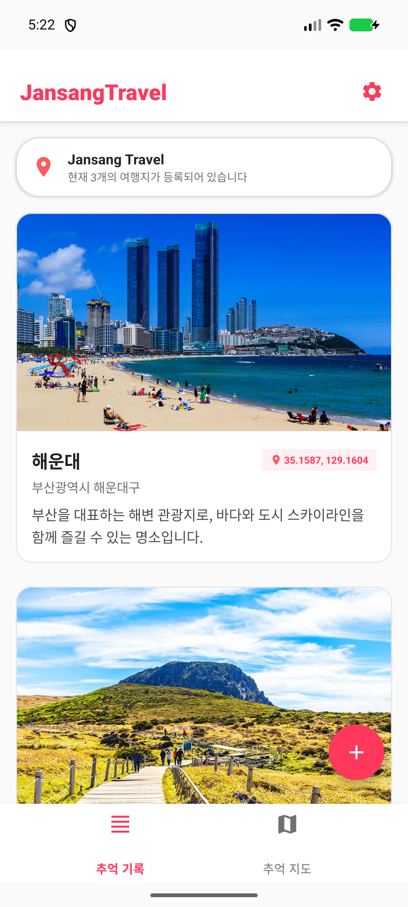

# Jansang Travel

> 여행의 추억을 기록하고 지도에서 위치를 확인하는 Android 여행 다이어리 앱

<p align="center">
  
  
  
  
  
</p>

---

## 프로젝트 소개

"Jansang Travel"은 여행 기록을 사진, 날짜, 메모, 위치 정보와 함께 저장하고 Google Maps에서 여행지 위치를 확인할 수 있는 Android 앱입니다.

모바일 프로그래밍 기말 텀프로젝트로 제작되었으며, 해운대, 한라산, 경복궁 기본 여행지를 중심으로 여행 기록 목록, 상세 화면, 지도 마커, 사진 선택, SQLite 기반 데이터 저장 기능을 제공합니다.

---

## 주요 기능

| 기능 | 설명 |
| --- | --- |
| 여행 기록 목록 | RecyclerView 카드 UI로 여행지명, 날짜, 사진, 메모 표시 |
| 여행 기록 상세 | 선택한 기록의 이미지, 메모, 좌표, 지도 위치 확인 |
| 기록 추가/수정 | 별도 Activity에서 여행지명, 날짜, 메모, 사진, 좌표 입력 및 수정 |
| 기록 삭제 | 목록 선택 삭제, 수정 화면 삭제, 전체 삭제 지원 |
| SQLite 저장 | SQLiteOpenHelper 기반 DBHelper로 CRUD 처리 |
| Google Maps | 지도 탭과 상세 화면에서 실제 지도 표시 |
| 지도 마커 | 해운대, 한라산, 경복궁 및 사용자 기록 위치 마커 표시 |
| 하단 탭 탐색 | 추억 기록 / 추억 지도 Fragment 전환 |

---

## 기술 스택

| 구분 | 기술 |
| --- | --- |
| Language | Kotlin |
| IDE | Android Studio |
| UI | XML Layout, ViewBinding, Material Components |
| Navigation | Activity, Fragment, BottomNavigationView |
| List | RecyclerView, Adapter, ViewHolder |
| Local DB | SQLiteOpenHelper |
| Map | Google Maps Android SDK, MapView |
| Image | Android Resource, Gallery/Camera Intent |
| Build | Gradle Kotlin DSL |

---

## 화면 미리보기

| 메인 화면 | 상세 화면 |
| --- | --- |
|  |  |

| 지도 탭 | 지도 마커 화면 |
| --- | --- |
|  |  |

---

## 대표 여행지

| 여행지 | 위치 | 좌표 |
| --- | --- | --- |
| 해운대 | 부산광역시 해운대구 | 35.1587, 129.1604 |
| 한라산 | 제주특별자치도 제주시/서귀포시 | 33.3617, 126.5292 |
| 경복궁 | 서울특별시 종로구 사직로 161 | 37.5796, 126.9770 |

---

## 프로젝트 구조

```text
JansangTravel/
├─ app/
│  ├─ build.gradle.kts
│  └─ src/main/
│     ├─ AndroidManifest.xml
│     ├─ java/com/example/
│     │  ├─ MainActivity.kt
│     │  ├─ DetailActivity.kt
│     │  ├─ AddEditActivity.kt
│     │  ├─ adapter/
│     │  │  └─ TravelAdapter.kt
│     │  ├─ db/
│     │  │  ├─ TravelDbHelper.kt
│     │  │  ├─ RecordRepository.kt
│     │  │  ├─ RecordViewModel.kt
│     │  │  └─ RecordEntity.kt
│     │  ├─ fragment/
│     │  │  ├─ TravelListFragment.kt
│     │  │  └─ TravelMapFragment.kt
│     │  └─ util/
│     │     ├─ ExifGpsExtractor.kt
│     │     ├─ MapsApiKeyValidator.kt
│     │     └─ RecordImageLoader.kt
│     └─ res/
│        ├─ drawable-nodpi/
│        │  ├─ img_haeundae.jpg
│        │  ├─ img_hallasan.jpg
│        │  └─ img_gyeongbokgung.jpg
│        ├─ layout/
│        ├─ menu/
│        └─ values/
├─ docs/screenshots/
│  ├─ main.png
│  ├─ detail.png
│  ├─ map.png
│  └─ map_marker.png
├─ gradle/
├─ build.gradle.kts
├─ settings.gradle.kts
└─ README.md
```

---

## 실행 방법

### 1. 프로젝트 열기

Android Studio에서 저장소 루트 폴더를 엽니다.

```text
C:\Users\PC\Desktop\모바일프로그래밍_텀프로젝트\jansang-travel-diary
```

또는 GitHub 저장소를 클론합니다.

```bash
git clone https://github.com/DevLSJ/JansangTravel.git
cd JansangTravel
```

### 2. Gradle Sync

Android Studio에서 **File > Sync Project with Gradle Files**를 실행합니다.

### 3. Google Maps API Key 설정

API Key는 공개 저장소에 직접 올리지 않는 것을 권장합니다. 로컬 개발 환경에서는 `local.properties`에 키를 둡니다.

```properties
MAPS_API_KEY=YOUR_GOOGLE_MAPS_API_KEY
```

`AndroidManifest.xml`에서는 다음 meta-data를 통해 Google Maps API Key가 연결됩니다.

```xml
<meta-data
    android:name="com.google.android.geo.API_KEY"
    android:value="@string/google_maps_key" />
```

Google Cloud Console에서 아래 항목도 확인해야 합니다.

- Maps SDK for Android 활성화
- 패키지명과 SHA-1 제한 설정 확인
- API Key 제한과 결제 설정 확인
- Google Play services가 포함된 에뮬레이터 사용

### 4. APK 빌드

Windows:

```powershell
.\gradlew.bat clean assembleDebug
```

APK 생성 위치:

```text
app/build/outputs/apk/debug/app-debug.apk
```

=======

---

## 구현 포인트

### 이미지 리소스 안정화

Android 리소스 규칙에 맞게 한글/괄호가 없는 파일명으로 정리했습니다.

| 여행지 | 리소스 |
| --- | --- |
| 해운대 | `img_haeundae.jpg` |
| 한라산 | `img_hallasan.jpg` |
| 경복궁 | `img_gyeongbokgung.jpg` |

이미지는 `app/src/main/res/drawable-nodpi/`에 배치해 원본 비율을 안정적으로 유지합니다.

### RecyclerView 기반 여행 기록 목록

기말 프로젝트 요구사항에 맞춰 여행 기록 목록은 `RecyclerView` 기반으로 구성했습니다.  
각 여행 기록은 카드 형태로 표시되며, 사용자는 목록에서 여행지명, 방문 날짜, 대표 이미지와 메모를 한눈에 확인할 수 있습니다.

- `Adapter`와 `ViewHolder` 직접 구현
- 여행지명, 방문 날짜, 대표 이미지/썸네일 표시
- 항목 클릭 시 상세 화면으로 이동
- 항목 길게 누르기 시 수정/삭제 컨텍스트 메뉴 제공

```kotlin
class TravelAdapter(
    private val items: MutableList<TravelRecord>,
    private val listener: OnTravelClickListener
) : RecyclerView.Adapter<TravelAdapter.TravelViewHolder>())
```

### Fragment 화면 전환 및 백스택 관리
앱은 최소 2개 이상의 Fragment로 구성되어 있으며, 하단 탭을 통해 여행 기록 목록 화면과 지도 화면을 전환할 수 있습니다.
BottomNavigationView를 활용해 TravelListFragment와 TravelMapFragment를 전환하고, 필요한 화면 이동에는 백스택을 추가해 뒤로가기 버튼을 눌렀을 때 이전 화면으로 자연스럽게 복귀하도록 처리했습니다.
TravelListFragment: 여행 기록 목록 표시
TravelMapFragment: Google Maps 기반 여행지 위치 표시
BottomNavigationView 기반 Fragment 전환
addToBackStack(null)을 통한 백스택 관리

```kotlin
supportFragmentManager.beginTransaction()
    .replace(R.id.fragment_container, fragment)
    .addToBackStack(null)
    .commit()
```

### 옵션 메뉴와 컨텍스트 메뉴

요구사항에 맞춰 옵션 메뉴와 컨텍스트 메뉴를 모두 구현했습니다.

메뉴 유형	|     구현 기능
| --- | --- |
옵션 메뉴	| 전체 삭제, 정렬 기준 변경, 앱 정보
컨텍스트 메뉴	| 항목 수정, 항목 삭제
톱니바퀴 메뉴	| 기록 선택 삭제

삭제 기능은 실수 방지를 위해 반드시 AlertDialog 확인 후 실행되도록 구성했습니다.

```kotlin
AlertDialog.Builder(requireContext())
    .setTitle("선택한 기록을 삭제할까요?")
    .setMessage("삭제한 여행 기록은 복구할 수 없습니다.")
    .setNegativeButton("취소", null)
    .setPositiveButton("삭제") { _, _ ->
        viewModel.deleteRecords(selectedIds)
    }
    .show()
```

### 카메라/갤러리 Intent 기반 사진 기록

여행 기록 작성 시 카메라 촬영 또는 갤러리 선택 Intent를 통해 사진을 기록할 수 있도록 구현했습니다.

갤러리 이미지 선택
카메라 촬영 흐름 대응
선택한 이미지 URI를 SQLite에 저장
상세 화면에서 저장된 사진 표시
권한 거부 또는 URI 누락 시 앱이 종료되지 않도록 예외 처리

### SQLiteOpenHelper 기반 CRUD

`TravelDbHelper`가 `SQLiteOpenHelper`를 상속하며, 여행 기록의 생성, 조회, 수정, 삭제, 전체 삭제를 직접 처리합니다.

```kotlin
insertTravel()
getAllTravels()
getTravelById()
updateTravel()
deleteTravel()
deleteTravels()
deleteAllTravels()
```

### Google Maps API 연동
Google Maps API를 활용해 여행 기록의 위치를 지도에서 확인할 수 있도록 구현했습니다.
지도 탭에서는 전체 여행지 위치가 마커로 표시되고, 상세 화면에서는 선택한 여행지의 위치만 집중해서 보여줍니다.
- 지도 탭에서 전체 여행지 마커 표시
- 상세 화면에서 선택한 여행지 위치 표시
- 해운대, 한라산, 경복궁 기본 좌표 제공
- 여행 기록 추가/수정 시 좌표 저장
- 여행 기록 삭제 시 지도 마커와 카운트 자동 갱신

### Google Maps 마커

저장된 여행 기록의 위도/경도를 기반으로 지도 탭과 상세 화면에 마커를 생성합니다.

```kotlin
val position = LatLng(latitude, longitude)
googleMap.addMarker(
    MarkerOptions()
        .position(position)
        .title(title)
        .snippet(location)
)
```

### 삭제 기능

- 목록 항목 길게 누르기: 수정/삭제 컨텍스트 메뉴
- 톱니바퀴 메뉴: 기록 선택 삭제
- 수정 화면: 이 기록 삭제
- 삭제 전 AlertDialog 확인
- 삭제 후 SQLite DB, RecyclerView 목록, 지도 마커, 카운트 갱신

---

## 향후 개선 방향

- 사용자 커스텀 여행지 검색 기능
- 즐겨찾기 기능
- 날짜별/지역별 필터
- GPS 기반 현재 위치 저장
- 사진 EXIF 기반 위치 정확도 개선
- 클라우드 백업 및 동기화

---

## 개발자 정보

| 항목 | 내용 |
| --- | --- |
| Developer | DevLSJ |
| Project | Jansang Travel |
| Type | Android 모바일 프로그래밍 기말 텀프로젝트 |
<<<<<<< HEAD
| Repository | https://github.com/DevLSJ/JansangTravel |
=======

>>>>>>> origin/master
