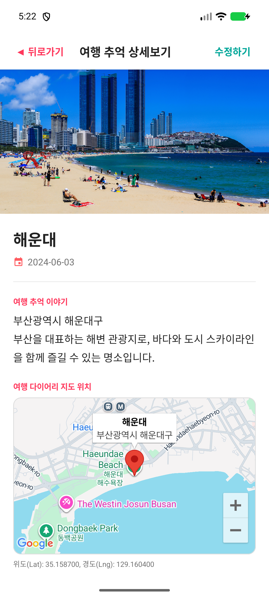
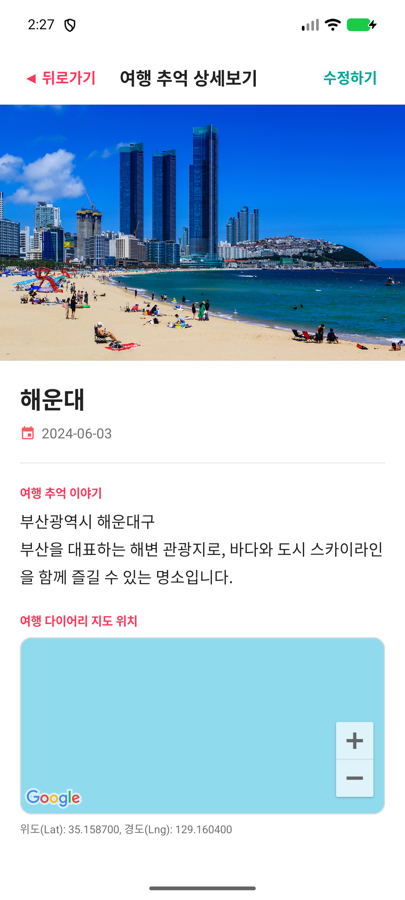
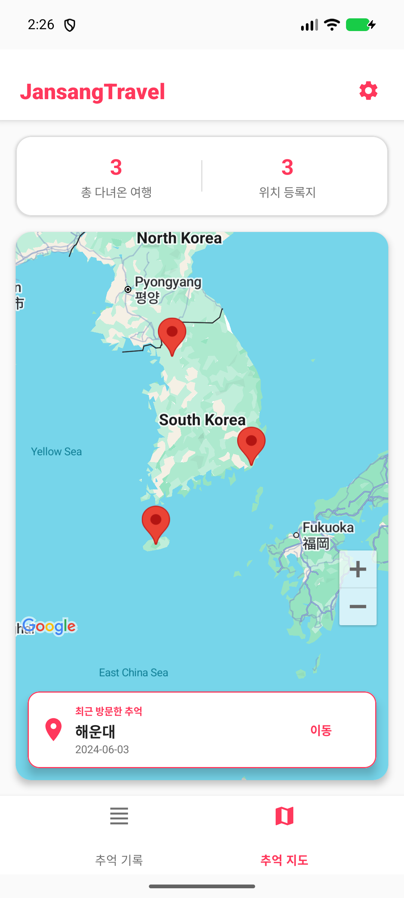

# Jansang Travel

> 여행의 추억을 기록하고 지도에서 위치를 확인하는 Android 여행 다이어리 앱

<<<<<<< HEAD
<<<<<<< HEAD
## 프로젝트 소개

Jansang Travel은 모바일 프로그래밍 기말 프로젝트로 제작한 Android 앱입니다. 사용자는 여행지명, 방문 날짜, 메모, 대표 사진, 위치 좌표를 저장하고, 기록된 여행지를 목록과 지도에서 확인할 수 있습니다.

대표 여행지 데이터로 해운대, 한라산, 경복궁을 기본 제공하며, Google Maps 지도와 마커를 통해 여행 위치를 직관적으로 확인할 수 있습니다.

## 주요 기능

- Fragment 2개 이상 구성: 여행 기록 목록, 추억 지도
- BottomNavigationView 기반 Fragment 전환 및 백스택 처리
- RecyclerView 기반 여행 기록 목록
- Adapter/ViewHolder 직접 구현
- 여행 기록 추가, 상세 조회, 수정, 단일 삭제, 전체 삭제
- SQLiteOpenHelper 기반 로컬 DB 저장
- 카메라 촬영 및 갤러리 이미지 선택
- 사진 EXIF GPS 정보 추출
- Google Maps 지도 표시 및 마커 생성
- 옵션 메뉴: 최신순, 오래된순, 제목순, 전체 삭제, 앱 정보
- 컨텍스트 메뉴: 항목 길게 누르기 후 수정/삭제

## 기술 스택

| 구분 | 사용 기술 |
| --- | --- |
| Language | Kotlin |
| IDE | Android Studio |
| UI | XML Layout, ViewBinding, Material Components |
| List | RecyclerView |
| Fragment | AndroidX Fragment |
| Database | SQLiteOpenHelper |
| Async | Kotlin Coroutines |
| Map | Google Maps Android SDK |
| Image | Camera Intent, Gallery Intent, FileProvider, ExifInterface |
| Build | Gradle Kotlin DSL |

## 화면 미리보기

| 메인 화면 | 지도 탭 | 상세 화면 |
| --- | --- | --- |
|  |  |  |

## 프로젝트 구조

```text
JansangTravel/
├── app/
│   ├── build.gradle.kts
│   └── src/main/
│       ├── AndroidManifest.xml
│       ├── java/com/example/
│       │   ├── MainActivity.kt
│       │   ├── AddEditActivity.kt
│       │   ├── DetailActivity.kt
│       │   ├── adapter/TravelAdapter.kt
│       │   ├── db/
│       │   │   ├── TravelDbHelper.kt
│       │   │   ├── RecordEntity.kt
│       │   │   ├── RecordRepository.kt
│       │   │   └── RecordViewModel.kt
│       │   ├── fragment/
│       │   │   ├── TravelListFragment.kt
│       │   │   └── TravelMapFragment.kt
│       │   └── util/
│       │       ├── ExifGpsExtractor.kt
│       │       ├── MapsApiKeyValidator.kt
│       │       └── RecordImageLoader.kt
│       └── res/
│           ├── drawable-nodpi/
│           │   ├── img_haeundae.jpg
│           │   ├── img_hallasan.jpg
│           │   └── img_gyeongbokgung.jpg
│           ├── layout/
│           └── menu/
├── gradle/
├── build.gradle.kts
├── settings.gradle.kts
└── README.md
```

## Google Maps API Key 설정

API Key는 GitHub에 커밋하지 않는 `local.properties` 또는 `.env`에 설정합니다.

```properties
sdk.dir=C\:\\Users\\PC\\AppData\\Local\\Android\\Sdk
MAPS_API_KEY=YOUR_GOOGLE_MAPS_API_KEY
```

`AndroidManifest.xml`은 Gradle에서 생성한 `@string/google_maps_key`를 참조합니다.

```xml
<meta-data
    android:name="com.google.android.geo.API_KEY"
    android:value="@string/google_maps_key" />
```

## 실행 방법

1. Android Studio에서 프로젝트 폴더를 엽니다.
2. `local.properties`에 Android SDK 경로와 `MAPS_API_KEY`를 설정합니다.
3. Gradle Sync를 실행합니다.
4. Google Play services가 포함된 에뮬레이터 또는 실제 기기에서 실행합니다.

## APK 빌드 방법

```powershell
cd C:\Users\PC\Desktop\모바일프로그래밍_텀프로젝트\jansang-travel-diary
.\gradlew.bat clean assembleDebug
```

생성 위치:

```text
app/build/outputs/apk/debug/app-debug.apk
```

## 제출 전 주의사항

- `local.properties`, `.env`, `debug.keystore`, `build/`, `.gradle/`, `.idea/`는 GitHub에 올리지 않습니다.
- Google Maps API Key가 이미 공개 저장소에 올라갔다면 키를 재발급하고 기존 키를 제한 또는 폐기하는 것을 권장합니다.
- 다른 PC에서 다시 빌드할 경우 해당 PC의 debug SHA-1과 package name을 Google Cloud Console API Key 제한에 등록해야 합니다.
=======
<p align="center">
  
  
  
  
  
</p>

---

## 📌 프로젝트 소개

"Jansang Travel"은 사용자가 여행지의 사진, 설명, 날짜, 위치를 한 번에 확인할 수 있도록 만든 Android 여행 기록 앱입니다.  
모바일 프로그래밍 기말 텀프로젝트로 제작되었으며, 유저 접근성을 높이기 위해 "여행지 상세 정보와 Google Maps 기반 위치 시각화 화면"을 함께 제공합니다.

이 앱은 다음과 같은 문제를 해결하고자 개발하였습니다.

- 여행지 사진과 설명이 따로 흩어져 있어 한눈에 보기 어려운 문제
- 여행 기록의 위치 정보를 지도에서 직관적으로 확인하기 어려운 문제
- 여러 여행지의 위치를 한 화면에서 비교하기 어려운 문제

Jansang Travel은 **해운대, 한라산, 경복궁**을 대표 여행지로 구성하였습니다.

---

## ✨ 주요 기능

| 기능 | 설명 |
| --- | --- |
| 여행지 리스트/카드 UI | 메인 화면에서 해운대, 한라산, 경복궁 여행지를 카드 형태로 확인 |
| 상세 정보 화면 | 여행지별 위치, 방문 날짜, 설명, 이미지를 상세 화면에서 제공 |
| 여행 이미지 표시 | Android 리소스 규칙에 맞춘 이미지 파일을 `drawable-nodpi`에서 안정적으로 출력 |
| Google Maps 지도 표시 | 상세 화면과 지도 탭에서 실제 Google Map 타일 표시 |
| 여행지 위치 마커 생성 | 해운대, 한라산, 경복궁 좌표 기반 마커 생성 |
| 다중 마커 지도 탭 | 하단 `추억 지도` 탭에서 여러 여행지 위치를 한 번에 확인 |
| 직관적인 하단 탭 탐색 | `추억 기록`과 `추억 지도`를 BottomNavigationView로 전환 |

---

## 🛠 기술 스택

| 구분 | 기술 |
| --- | --- |
| Language | Kotlin |
| IDE | Android Studio |
| UI | XML Layout, ViewBinding, Material Components |
| Architecture | Activity, Fragment, RecyclerView, Room |
| Map | Google Maps API, Google Maps Android SDK, MapView |
| Local Data | Room Database |
| Image Resource | `res/drawable-nodpi` |
| Build | Gradle Kotlin DSL |
| Min SDK | 24 |
| Target SDK | 36 |

> 참고: 프로젝트에는 Compose 관련 Gradle 설정이 일부 포함되어 있지만, 실제 주요 화면은 XML 레이아웃과 ViewBinding 기반으로 구현되어 있습니다.

---

## 🖼 화면 미리보기

| 메인 화면 | 상세 화면 |
| --- | --- |
|  |  |

| 지도 탭 | 지도 개선 후 화면 |
| --- | --- |
|  |  |

### 대표 여행지

| 여행지 | 위치 | 좌표 |
| --- | --- | --- |
| 해운대 | 부산광역시 해운대구 | 35.1587, 129.1604 |
| 한라산 | 제주특별자치도 제주시/서귀포시 | 33.3617, 126.5292 |
| 경복궁 | 서울특별시 종로구 사직로 161 | 37.5796, 126.9770 |

---

## 📁 프로젝트 구조

```text
JansangTravel/
├── app/
│   ├── build.gradle.kts
│   └── src/main/
│       ├── AndroidManifest.xml
│       ├── java/com/example/
│       │   ├── MainActivity.kt
│       │   ├── DetailActivity.kt
│       │   ├── AddEditActivity.kt
│       │   ├── adapter/
│       │   │   └── TravelAdapter.kt
│       │   ├── db/
│       │   │   ├── AppDatabase.kt
│       │   │   ├── RecordDao.kt
│       │   │   ├── RecordEntity.kt
│       │   │   └── RecordViewModel.kt
│       │   ├── fragment/
│       │   │   ├── TravelListFragment.kt
│       │   │   └── TravelMapFragment.kt
│       │   └── util/
│       │       ├── MapsApiKeyValidator.kt
│       │       └── RecordImageLoader.kt
│       └── res/
│           ├── drawable-nodpi/
│           │   ├── img_haeundae.jpg
│           │   ├── img_hallasan.jpg
│           │   └── img_gyeongbokgung.jpg
│           ├── layout/
│           │   ├── activity_main.xml
│           │   ├── activity_detail.xml
│           │   ├── fragment_travel_list.xml
│           │   └── fragment_travel_map.xml
│           ├── menu/
│           │   └── bottom_nav_menu.xml
│           └── values/
│               └── google_maps_api.xml
├── gradle/
├── build.gradle.kts
├── settings.gradle.kts
└── README.md
```

---

## 🚀 실행 방법

### 1. 프로젝트 열기

Android Studio에서 아래 경로의 프로젝트를 엽니다.

```text
C:\Users\PC\AndroidStudioProjects\JansangTravel
```

또는 GitHub 저장소를 클론합니다.

```bash
git clone https://github.com/DevLSJ/JansangTravel.git
cd JansangTravel
```

### 2. Gradle Sync

Android Studio 상단의 **Sync Project with Gradle Files**를 실행합니다.

### 3. Google Maps API Key 설정

Google Maps API 키는 아래 파일에서 관리합니다.

```text
app/src/main/res/values/google_maps_api.xml
```

예시:

```xml
<resources>
    <string name="google_maps_key" translatable="false">YOUR_GOOGLE_MAPS_API_KEY</string>
</resources>
```

`AndroidManifest.xml`에서는 다음과 같이 문자열 리소스를 참조합니다.

```xml
<meta-data
    android:name="com.google.android.geo.API_KEY"
    android:value="@string/google_maps_key" />
```

> 보안을 위해 공개 저장소에서는 실제 API 키 노출을 피하고, 필요 시 키 제한과 환경별 설정을 적용하는 것을 권장합니다.

### 4. 에뮬레이터 실행

Google Maps가 정상 표시되려면 다음 조건을 확인하세요.

- Google Play services가 포함된 Android Emulator 사용
- 인터넷 연결 가능
- Google Cloud Console에서 **Maps SDK for Android** 활성화
- API 키 제한 사용 시 package name과 SHA-1 등록

### 5. 빌드

```bash
./gradlew clean assembleDebug
```

Windows에서 Gradle wrapper가 없는 환경이라면 Android Studio의 **Build > Rebuild Project** 또는 설치된 Gradle을 사용할 수 있습니다.

---

## 🔍 구현 포인트

### 이미지 리소스 출력 문제 해결

Android 리소스 파일명은 한글, 공백, 괄호를 사용할 수 없으므로 이미지 파일을 다음과 같이 정리했습니다.

| 여행지 | 리소스명 |
| --- | --- |
| 해운대 | `img_haeundae.jpg` |
| 한라산 | `img_hallasan.jpg` |
| 경복궁 | `img_gyeongbokgung.jpg` |

이미지는 `app/src/main/res/drawable-nodpi/`에 배치해 원본 비율과 품질을 유지하면서 안정적으로 출력되도록 구성했습니다.

### Google Maps 흰 화면 문제 해결

Google 로고만 보이고 지도 타일이 보이지 않는 문제를 해결하기 위해 다음 항목을 점검했습니다.

- `AndroidManifest.xml`의 Google Maps API Key 메타데이터 연결
- `INTERNET`, `ACCESS_NETWORK_STATE` 권한 추가
- Google Maps Android SDK 의존성 확인
- MapView 크기 및 초기화 시점 확인
- Logcat에서 인증 실패, API 비활성화, 결제 오류 여부 확인

### 마커 생성 및 카메라 이동

`TravelMapFragment`에서 저장된 여행 기록의 위도/경도를 기반으로 마커를 생성하고, 대한민국 전체가 보이도록 카메라 위치를 조정했습니다.

```kotlin
val position = LatLng(latitude, longitude)
googleMap.addMarker(
    MarkerOptions()
        .position(position)
        .title(title)
        .snippet(location)
)
```

### 상세 화면 지도 연동

`DetailActivity`의 지도 영역에는 선택한 여행지의 좌표를 기준으로 마커와 카메라를 표시합니다.  
지도 로드 완료 시점에도 카메라를 다시 조정해 상세 화면에서 마커와 정보창이 안정적으로 보이도록 구현했습니다.

---

## 🧭 향후 개선 방향

- 즐겨찾기 기능
- 지도에서 직접 위치 선택 후 AI API 기반 기록 생성 기능
- Room DB 마이그레이션 정책 개선
- Firebase 또는 클라우드 기반 여행 기록 동기화
- 여행 일정 공유 기능

---

## 👤 개발자 정보

| 항목 | 내용 |
| --- | --- |
| Developer | DevLSJ |
| Project | Jansang Travel |
| Repository | https://github.com/DevLSJ/JansangTravel |
| Type | Android 모바일 프로그래밍 기말 텀프로젝트 |

>>>>>>> origin/master
=======
<p align="center">
  
  
  
  
  
</p>

---

## 📌 프로젝트 소개

"Jansang Travel"은 사용자가 여행지의 사진, 설명, 날짜, 위치를 한 번에 확인할 수 있도록 만든 Android 여행 기록 앱입니다.  
모바일 프로그래밍 기말 텀프로젝트로 제작되었으며, 유저 접근성을 높이기 위해 "여행지 상세 정보와 Google Maps 기반 위치 시각화 화면"을 함께 제공합니다.

이 앱은 다음과 같은 문제를 해결하고자 개발하였습니다.

- 여행지 사진과 설명이 따로 흩어져 있어 한눈에 보기 어려운 문제
- 여행 기록의 위치 정보를 지도에서 직관적으로 확인하기 어려운 문제
- 여러 여행지의 위치를 한 화면에서 비교하기 어려운 문제

Jansang Travel은 **해운대, 한라산, 경복궁**을 대표 여행지로 구성하였습니다.

---

## ✨ 주요 기능

| 기능 | 설명 |
| --- | --- |
| 여행지 리스트/카드 UI | 메인 화면에서 해운대, 한라산, 경복궁 여행지를 카드 형태로 확인 |
| 상세 정보 화면 | 여행지별 위치, 방문 날짜, 설명, 이미지를 상세 화면에서 제공 |
| 여행 이미지 표시 | Android 리소스 규칙에 맞춘 이미지 파일을 `drawable-nodpi`에서 안정적으로 출력 |
| Google Maps 지도 표시 | 상세 화면과 지도 탭에서 실제 Google Map 타일 표시 |
| 여행지 위치 마커 생성 | 해운대, 한라산, 경복궁 좌표 기반 마커 생성 |
| 다중 마커 지도 탭 | 하단 `추억 지도` 탭에서 여러 여행지 위치를 한 번에 확인 |
| 직관적인 하단 탭 탐색 | `추억 기록`과 `추억 지도`를 BottomNavigationView로 전환 |

---

## 🛠 기술 스택

| 구분 | 기술 |
| --- | --- |
| Language | Kotlin |
| IDE | Android Studio |
| UI | XML Layout, ViewBinding, Material Components |
| Architecture | Activity, Fragment, RecyclerView, Room |
| Map | Google Maps API, Google Maps Android SDK, MapView |
| Local Data | Room Database |
| Image Resource | `res/drawable-nodpi` |
| Build | Gradle Kotlin DSL |
| Min SDK | 24 |
| Target SDK | 36 |

> 참고: 프로젝트에는 Compose 관련 Gradle 설정이 일부 포함되어 있지만, 실제 주요 화면은 XML 레이아웃과 ViewBinding 기반으로 구현되어 있습니다.

---

## 🖼 화면 미리보기

| 메인 화면 | 상세 화면 |
| --- | --- |
|  |  |

| 지도 탭 | 지도 개선 후 화면 |
| --- | --- |
|  |  |

### 대표 여행지

| 여행지 | 위치 | 좌표 |
| --- | --- | --- |
| 해운대 | 부산광역시 해운대구 | 35.1587, 129.1604 |
| 한라산 | 제주특별자치도 제주시/서귀포시 | 33.3617, 126.5292 |
| 경복궁 | 서울특별시 종로구 사직로 161 | 37.5796, 126.9770 |

---

## 📁 프로젝트 구조

```text
JansangTravel/
├── app/
│   ├── build.gradle.kts
│   └── src/main/
│       ├── AndroidManifest.xml
│       ├── java/com/example/
│       │   ├── MainActivity.kt
│       │   ├── DetailActivity.kt
│       │   ├── AddEditActivity.kt
│       │   ├── adapter/
│       │   │   └── TravelAdapter.kt
│       │   ├── db/
│       │   │   ├── AppDatabase.kt
│       │   │   ├── RecordDao.kt
│       │   │   ├── RecordEntity.kt
│       │   │   └── RecordViewModel.kt
│       │   ├── fragment/
│       │   │   ├── TravelListFragment.kt
│       │   │   └── TravelMapFragment.kt
│       │   └── util/
│       │       ├── MapsApiKeyValidator.kt
│       │       └── RecordImageLoader.kt
│       └── res/
│           ├── drawable-nodpi/
│           │   ├── img_haeundae.jpg
│           │   ├── img_hallasan.jpg
│           │   └── img_gyeongbokgung.jpg
│           ├── layout/
│           │   ├── activity_main.xml
│           │   ├── activity_detail.xml
│           │   ├── fragment_travel_list.xml
│           │   └── fragment_travel_map.xml
│           ├── menu/
│           │   └── bottom_nav_menu.xml
│           └── values/
│               └── google_maps_api.xml
├── gradle/
├── build.gradle.kts
├── settings.gradle.kts
└── README.md
```

---

## 🚀 실행 방법

### 1. 프로젝트 열기

Android Studio에서 아래 경로의 프로젝트를 엽니다.

```text
C:\Users\PC\AndroidStudioProjects\JansangTravel
```

또는 GitHub 저장소를 클론합니다.

```bash
git clone https://github.com/DevLSJ/JansangTravel.git
cd JansangTravel
```

### 2. Gradle Sync

Android Studio 상단의 **Sync Project with Gradle Files**를 실행합니다.

### 3. Google Maps API Key 설정

Google Maps API 키는 아래 파일에서 관리합니다.

```text
app/src/main/res/values/google_maps_api.xml
```

예시:

```xml
<resources>
    <string name="google_maps_key" translatable="false">YOUR_GOOGLE_MAPS_API_KEY</string>
</resources>
```

`AndroidManifest.xml`에서는 다음과 같이 문자열 리소스를 참조합니다.

```xml
<meta-data
    android:name="com.google.android.geo.API_KEY"
    android:value="@string/google_maps_key" />
```

> 보안을 위해 공개 저장소에서는 실제 API 키 노출을 피하고, 필요 시 키 제한과 환경별 설정을 적용하는 것을 권장합니다.

### 4. 에뮬레이터 실행

Google Maps가 정상 표시되려면 다음 조건을 확인하세요.

- Google Play services가 포함된 Android Emulator 사용
- 인터넷 연결 가능
- Google Cloud Console에서 **Maps SDK for Android** 활성화
- API 키 제한 사용 시 package name과 SHA-1 등록

### 5. 빌드

```bash
./gradlew clean assembleDebug
```

Windows에서 Gradle wrapper가 없는 환경이라면 Android Studio의 **Build > Rebuild Project** 또는 설치된 Gradle을 사용할 수 있습니다.

---

## 🔍 구현 포인트

### 이미지 리소스 출력 문제 해결

Android 리소스 파일명은 한글, 공백, 괄호를 사용할 수 없으므로 이미지 파일을 다음과 같이 정리했습니다.

| 여행지 | 리소스명 |
| --- | --- |
| 해운대 | `img_haeundae.jpg` |
| 한라산 | `img_hallasan.jpg` |
| 경복궁 | `img_gyeongbokgung.jpg` |

이미지는 `app/src/main/res/drawable-nodpi/`에 배치해 원본 비율과 품질을 유지하면서 안정적으로 출력되도록 구성했습니다.

### Google Maps 흰 화면 문제 해결

Google 로고만 보이고 지도 타일이 보이지 않는 문제를 해결하기 위해 다음 항목을 점검했습니다.

- `AndroidManifest.xml`의 Google Maps API Key 메타데이터 연결
- `INTERNET`, `ACCESS_NETWORK_STATE` 권한 추가
- Google Maps Android SDK 의존성 확인
- MapView 크기 및 초기화 시점 확인
- Logcat에서 인증 실패, API 비활성화, 결제 오류 여부 확인

### 마커 생성 및 카메라 이동

`TravelMapFragment`에서 저장된 여행 기록의 위도/경도를 기반으로 마커를 생성하고, 대한민국 전체가 보이도록 카메라 위치를 조정했습니다.

```kotlin
val position = LatLng(latitude, longitude)
googleMap.addMarker(
    MarkerOptions()
        .position(position)
        .title(title)
        .snippet(location)
)
```

### 상세 화면 지도 연동

`DetailActivity`의 지도 영역에는 선택한 여행지의 좌표를 기준으로 마커와 카메라를 표시합니다.  
지도 로드 완료 시점에도 카메라를 다시 조정해 상세 화면에서 마커와 정보창이 안정적으로 보이도록 구현했습니다.

---

## 🧭 향후 개선 방향

- 즐겨찾기 기능
- 지도에서 직접 위치 선택 후 AI API 기반 기록 생성 기능
- Room DB 마이그레이션 정책 개선
- Firebase 또는 클라우드 기반 여행 기록 동기화
- 여행 일정 공유 기능

---

## 👤 개발자 정보

| 항목 | 내용 |
| --- | --- |
| Developer | DevLSJ |
| Project | Jansang Travel |
| Repository | https://github.com/DevLSJ/JansangTravel |
| Type | Android 모바일 프로그래밍 기말 텀프로젝트 |

>>>>>>> origin/master
